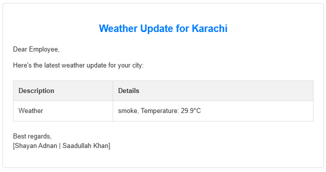

# Weather Update Sender

This program is created by collaboration of both <a href="#shayan-adnan">Shayan Adnan</a> with <a href="#saadullah-khan">Saadullah Khan</a>. This aims to _notify_ the registered user through **email** about the **weather**, _personalized with their respective cities._

## Key Points:
- Fetch the data from google sheet via Sheety API.
- Fetch the weather for each unique city.
- For same city, create cached data so the API call can be saved.
- Notify the user through email via SMTP with TLS encryption.

## Dependencies:
- CPython 3 or newer
- `requests` : A module that helps for **HTTP** method.
    - `pip install requests`

## Setup:
- Make Sure that `main.py` is also in same directory with the `app.py` as it uses `app.py` as dependency!

Change the configuration in `main.py`. read below guidance:

**SMTP CONFIGURATIONS**

- `SMTP_EMAIL`: Email that uses to _communicate_ with SMTP Servers and also uses as _Sender email_.
- `SMTP_EMAIL_PASSWORD`: Password for the SMTP email to verify the user.
- `SMTP_SERVER`: Which SMTP server you want to use.
- `SMTP_TLS_PORT`: TLS port for your chosed server.

**APIs CONFIGURATIONS**
- `OPEN_WEATHER_MAP_API`: Open weather _API_ to fetch the weather. Register for free: [Open Weather Map](https://openweathermap.org/).
- `SHEETY_END_POINT`: Sheety API to get the data from google sheet, Register for free: [Sheety](https://sheety.co/)
    - Make sure your data will be in below format: 
    
    - Sheet name is default: `Sheet1`

## Formatted Email:

## Cached Data:

---
<h2 id="shayan-adnan"><a href="https://www.linkedin.com/in/shayan-adnan-29a1102a5/">Shayan Adnan</a></h2>
<h2 id="saadullah-khan"><a href="https://www.linkedin.com/in/saadullahkhan3/">Saadullah Khan</a></h2>
